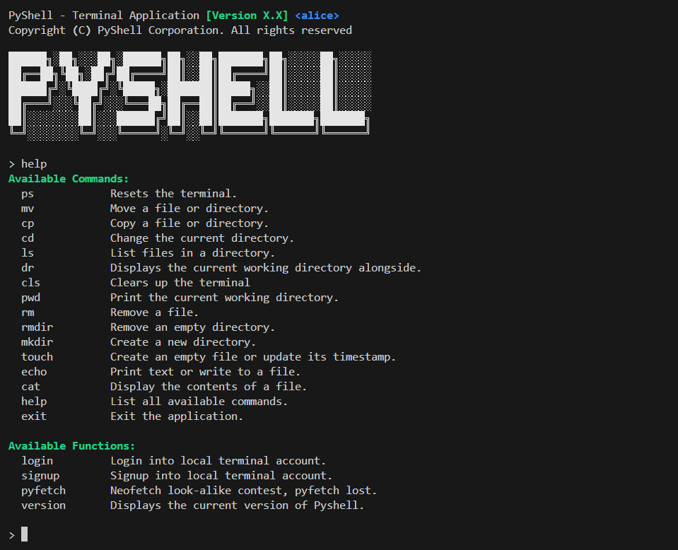

# PyShell

## Overview
PyShell is a lightweight, cross-platform, and customizable Python-based terminal application designed to provide a familiar shell experience with enhanced features. It offers essential command-line utilities, secure user account management, and detailed system information inspired by popular tools like Neofetch.




## Features
PyShell provides a robust set of functionalities to manage your system and enhance your command-line experience:
- **Core Shell Commands**: Emulates fundamental Unix-like commands including `mv` (move), `cp` (copy), `cd` (change directory), `ls` (list contents), `pwd` (print working directory), `rm` (remove files), `rmdir` (remove empty directories), `mkdir` (create directories), `touch` (create/update files), `echo` (print text/redirect), and `cat` (display file contents).
- **User Account Management**: Securely handles local user accounts with `signup` and `login` commands. Passwords are protected using robust `bcrypt` hashing.
- **System Information (`pyfetch`)**: Displays comprehensive hardware and OS details such as CPU, GPU, operating system version, kernel information, system uptime, total and used memory, and screen resolution, presented in an easy-to-read format.
- **Interactive Terminal**: Powered by `rich` library for beautiful and consistent command-line output and interactive prompts.
- **Extensible Architecture**: Designed with modularity in mind, allowing for straightforward addition of new commands and functionalities.

## Project Structure
```
pyshell/
├── pyshell/
│   ├── pyshell.py      # Main application entry point and command dispatcher.
│   ├── terminal.py     # Centralized rich.Console instance and helper functions entry point.
├── assets/
│   ├── pyshell.png        # Screenshot showcasing PyShell's interface.
├── shared/
│   ├── utils.py           # Contains core PyShell commands, user management logic,
│   │                      # and other general utility functions.
│   ├── pyfetch.py         # Module for gathering and displaying system hardware information.
│   ├── cputils.py         # Helper for CPU brand information (modified cpuinfo module).
│   └── __init__.py        # Marks 'shared' as a Python package.
└── .gitignore         # Git ignore file
├── Pipfile            # Specifies project dependencies using pipenv.
├── Pipfile.lock       # Locks specific versions of dependencies for reproducible builds.
├── LICENSE            # Project's licensing information (Apache-2.0 License)
├── README.md          # This README file, providing project overview and documentation.
```

## Installation

1. **Install pipenv (if you haven't already)**:
   ```bash
    pip install pipenv
   ```

2. **Clone the repository**:
   ```bash
    git clone https://github.com/hinmbo/pyshell.git
    cd pyshell
   ```

3. **Install dependencies and set up virtual environment**: `pipenv` will read the `Pipfile`, create a virtual environment (if one doesn't exist), and install all necessary packages.
   ```bash
   pipenv install
   ```

4. **Run PyShell**: Execute PyShell within the `pipenv` shell. This command activates the virtual environment and runs the application.
   ```bash
   pipenv run python -m pyshell/pyshell.py
   ```

    _Alternatively_, you can enter the pipenv shell and then run the command:
      ```bash
        pipenv shell
        python -m pyshell.pyshell
        # Exit the pipenv shell when done:
        # exit
      ```

    _Note: If you encounter issues, ensure your Python executable is correctly added to your system's PATH._

## Usage
### Example Commands
Here are a few examples demonstrating PyShell's functionality:
- **File Operations**:
  ```
  > mkdir test_dir
  > touch test_file.txt
  > mv test_file.txt test_dir/
  ```
- **User Management**:
  ```
  > signup
  Username: alice
  Password: ••••••
  Retype password: ••••••
  <> 'bob' has been created successfully

  > login
  Enter username: alice
  Enter password: ••••••
  ```
- **System Information**:
  ```
  > pyfetch
  ┏━━━━━━━━━━━━┳━━━━━━━━━━━━━━━━━━━━━━━━━━━━━━━━━━━━━━━━━━━━━━━┓
  ┃ pyfetch    ┃ System Information                            ┃
  ┡━━━━━━━━━━━━╇━━━━━━━━━━━━━━━━━━━━━━━━━━━━━━━━━━━━━━━━━━━━━━━┩
  │ OS         │ Windows 11 (v10.0.26100)                      │
  │ Host       │ SN1987A-S                                     │
  │ Kernel     │ Windows NT kernel                             │
  │ Uptime     │ 5:37:04                                       │
  │ Shell      │ pyshell                                       │
  │ Resolution │ 1920x1080                                     │
  ├────────────┼───────────────────────────────────────────────┤
  │ CPU        │ AMD Ryzen 5 5600X 6-Core Processor (6C / 12T) │
  │ GPU        │ NVIDIA GeForce RTX 3060 (VRAM: 12288MB)       │
  │ Memory     │ 13365MB / 32694MB                             │
  └────────────┴───────────────────────────────────────────────┘
  ```

## Contributing
Contributions are always weclome to PyShell! If you're interested in improving the project, please follow these steps:
1. **Fork the repository.**
2. **Create a feature branch** for your changes:
   ```bash
   git checkout -b feature/your-feature-name
   ```
3. **Commit your changes** with a clear and descriptive commit message: 
   ```bash
   git commit -m "feat: Add new command 'example' for demonstration"
   ```
4. **Push your changes** to your forked repository:
   ```bash
   git push origin feature/your-feature-name
   ```
5. **Open a Pull Request.**

## License
This project is licensed under the Apache-2.0 License. See the `LICENSE` file for details.

## Acknowledgments
- Inspired by the functionality and spirit of traditional Unix-like shells and system information tools like Neofetch.